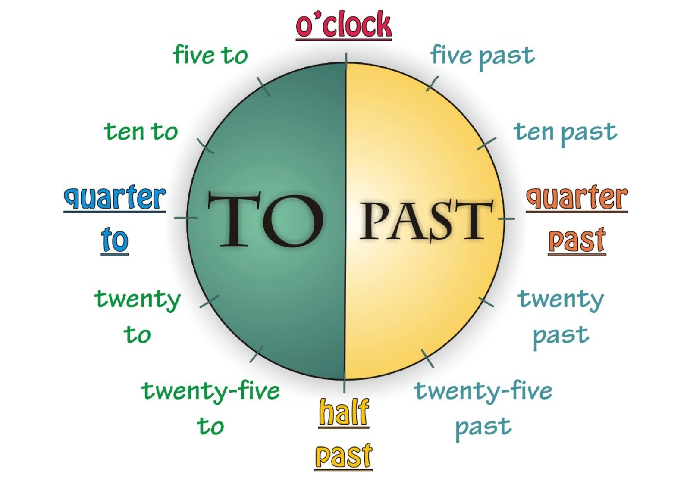
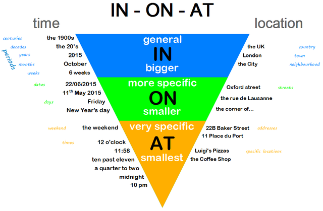

## Appunti Inglese


### Numerali

|               | **Cardinali**        | **Ordinali**  | **Ordinali Forma Breve** |
| ------------- | -------------------- | ------------- | ------------------------ |
| 0             | Zero, O, Nought, Nil | //            | //                       |
| 1             | One                  | First         | 1st                      |
| 2             | Two                  | Second        | 2nd                      |
| 3             | Three                | Third         | 3rd                      |
| 4             | Four                 | Fourth        | 4th                      |
| 5             | Five                 | Fifth         | 5th                      |
| 6             | Six                  | Sixth         | 6ht                      |
| 7             | Seven                | Seventh       | 7th                      |
| 8             | Eight                | Eight         | 8th                      |
| 9             | Nine                 | Ninth         | 9th                      |
| 10            | Ten                  | Tenth         | 10th                     |
| 11            | Eleven               | Eleventh      | 11th                     |
| 12            | Twelve               | Twelfth       | 12th                     |
| 22            | Twenty-two           | Twenty-Second | 22nd                     |
| 30            | Thirty               | Thirtieth     | 30th                     |
| 100           | One hundred          | Hundredth     | 100th                    |
| 1000          | One thousand         | Thousandth    | 1000th                   |
| 1.000.000     | One million          | Millionth     | 1000000th                |
| 1.000.000.000 | One billion          | Billionth     | 100000000000th           |

Regole nella lettura o scrittura dei numeri:

* Durante un dettato i numeri doppi possono essere pronunciati sfruttato "double". Es. _Double Five_ corrisponde a _55_;
* I numeri ripetuti più volte sfrutteranno "n time +n". Es. Three Times Six corrisponde a *666*;
* Lo zero si pronuncia:
  * Nought: per l’aritmetica;
  * Zero: per i gradi o anche generalmente nella matematica;
  * O (oh): quando si leggono i numeri uno alla volta (es. pronuncia di un numero di telefono);
  * Nil: Per il risultato di un match sportivo (2-0 si legge two nil).
* In inglese si usa la virgola per separare le migliaia anziché il punto: *2,893 (duemilaottocentonovantatre)*;
* In inglese si usa il punto per separare le unità decimali: *0.5*.


### Le ore

Per leggere le ore in Inglese è necessario osservare in quale quadrante, di un orologio analogico, si trovino le lancette dei minuti:

* Se le lancette dei minuti è nella prima metà dell'orologio (a destra) dobbiamo indicare il numero dei minuti seguito da *past* e dall'ora in cui ci troviamo;
* Se le lancette dei minuti è nella seconda metà dell'orologio (a sinistra) dobbiamo indicare il numero di minuti che mancano all'ora successiva a quella in cui ci troviamo, seguito da *to* e dall'ora che deve avvenire.

Schema utile per una veloce comprensione:



Alcuni esempi:

| **Orario** | **Traduzione**                                         |
| ---------- | ------------------------------------------------------ |
| 3:20       | It’s twenty past three                                 |
| 3:40       | It’s twenty to four                                    |
| 19:30      | It's half past seven p.m.                              |
| 17:45      | It’s a quarter to six p.m. (mancano 15 minuti alle 18) |
| 12:30      | It’s half past twelve p.m.                             |
| 22:15      | It's a quarter past ten p.m.                           |

Alcune abitudini per indicare un orario:

| Italiano      | Inglese           |
| ------------- | ----------------- |
| In punto      | O’ Clock - Sharp  |
| Un quarto     | A quarter past/to |
| E mezza       | Half Past         |
| Mezzogiorno   | Middady - Noon    |
| Mezzanotte    | Midnight          |
| Di pomeriggio | P.M.              |
| Di mattina    | A.M.              |

Note: 

* In inglese non si usa mai la notazione di 24ore (14, 18, ecc) ma la notazione di 12 ore seguita da AM o PM se dobbiamo indicare la mattina o il pomeriggio.


### Giorni della Settimana 

| **Italiano** | **Inglese**                  |
| ------------ | ---------------------------- |
| Lunedì       | Monday  (si legge mandei)    |
| Martedì      | Tuesday (si legge tiuSdei)   |
| Mercoledì    | Wednesday (si legge uenSdei) |
| Giovedì      | Thursday (si legge THéSdei)  |
| Venerdì      | Friday (si legge fraidei)    |
| Sabato       | Saturday (si legge satedei)  |
| Domenica     | Sunday (si legge sandei)     |

Note:

* I giorni della settimana in Inglese si scrivono sempre con la prima lettera maiuscola (ma è una abitudine oramai abbandonata);
* Si sfrutta la preposizione *on* per indicare il giorno (es. *On Monday I'm calling a lawyer*);
* Se si aggiunge una *s* alla fine del giorno si intento "Tutti i..." o "Ogni..."(es. *If functions every night, except Mondays*)


### Mesi

| **Italiano** | **Inglese**                              | Inglese (forma breve) |
| ------------ | ---------------------------------------- | --------------------- |
| Gennaio      | January (si legge gianiuari)             | Jan                   |
| Febbraio     | February (si pronuncia come in italiano) | Feb                   |
| Marzo        | March (si legge màc)                     | Mar                   |
| Aprile       | April (si legge eiprol)                  | Apr                   |
| Maggio       | May (si legge mei)                       | May                   |
| Giugno       | June (si legge giùn)                     | Jun                   |
| Luglio       | July (si legge giulai)                   | Jul                   |
| Agosto       | August (si legge ógast)                  | Aug                   |
| Settembre    | September (si legge sepˈtembə)           | Sept                  |
| Ottobre      | October (si legge oktouba)               | Oct                   |
| Novembre     | November (si legge nouvemba)             | Nov                   |
| Dicembre     | December (si legge disemba)              | Dec                   |

Note:

* I mesi in Inglese si scrivono sempre con la prima lettera maiuscola (ma è una abitudine oramai abbandonata);
* Si sfrutta la preposizione *in* per indicare i mesi (es. *In May it is spring*).


### Date

Per formulare le date possono essere usati due sistemi:

| Metodo                      | Forma scritta | Forma dettata      |
| --------------------------- | ------------- | ------------------ |
| Prima il giorno poi il mese | 2nd June      | The second of June |
| Prima il mese poi il giorno | June 2nd      | June the second    |

Gli anni non sono mai preceduti dall’articolo e vengono letti a coppie di cifre, ovvero:

| **Anno** | **Si legge** | **Traduzione**          |
| -------- | ------------ | ----------------------- |
| 1988     | 19 + 88      | Nineteen + Eighty-Eight |
| 1900     | 19 + 100     | Nineteen +Hundred       |
| 2000     | 2000         | Two Thousand            |
| 2001     | 2000 + 1     | Tho Thousand and One    |
| 2010     | 20+10        | Twenty + Ten            |

Note:

* Nell'inglese britannico le date si scrivono in numeri nello stesso ordine che in italiano, ovvero giorno/mese/anno (es. *15/05/2002*)
* Nell'inglese americano le date si scrivono nel formato mese/giorno/anno (es. *05/15/2002*);
* Dal 2000 al 2009 gli anni si leggono in forma estesa come se dovessi leggere un numero dal 2010 in poi si prende a leggere gli anni separando le due decine come visibile nella tabella superiore;
* Per i secoli non si usano i numeri romani ma i numeri ordinali (es. *19th Century*);


### Pronomi Personali

In inglese, come nelle altre lingue, ci sono due tipologie di pronomi personali:

- **Soggetto**: sono coloro che compiono l’azione;
- **Complemento**: sono coloro che ricevono l’azione compiuta da un pronome soggetto.

| **Italiano** | **Soggetto** | **Italiano** | **Complemento** |
| ------------ | ------------ | ------------ | --------------- |
| Io           | I            | Me/Mi        | Me              |
| Tu           | You          | Te/Ti        | You             |
| Egli         | He           | Lui          | Him             |
| Ella         | She          | Lei          | Her             |
| Esso/a       | It           |              | It              |
| Noi          | We           | Noi/Ci       | Us              |
| Voi          | You          | Voi/Vi       | You             |
| Essi         | They         | Essi/Loro    | Them            |

Note:

* Il pronome personale complemento segue sempre la preposizione o il verbo da cui dipende. (Es. *I love her*);
* Il pronome personale complemento può essere usato come complemento oggetto, direttamente dopo il verbo, o come complemento indiretto dopo una preposizione:
  * Complemento oggetto: *I know her*;
  * Complemento indiretto: *They are here with us*.


Esempi:

- She speaks to him; *She (pronome soggetto) - Him (pronome complemento)*
- You love me; *You (pronome soggetto) - Me (Pronome complemento)*
- Hi Tom. Nice to see you;
- How often does your mother tell you to do your homework?;
- I can see him now; (complemento di un verbo)
- Tell me what happened; (complemento di termine)
- I went on vacation with the. (complemento indiretto)


### Plurale

In Inglese il plurale dei sostantivi si forma, di norma, aggiungendo una “s" al sostantivo. 

| Singolare | Plurale |
| --------- | ------- |
| Dog       | Dogs    |
| Horse     | Horses  |
| Boy       | Boys    |
| Friend    | Friends |

Note:

* In inglese gli aggettivi non si rendono mai al plurale a differenza dell'italiano, es:
  * Due ragazzi allegri - Tho happy boys; (happy non diventa happies)
  * Quelle sono alcune patate calde - Those are some hot potatoes. (Hot non diventa hots)

**Eccezioni:**

Esistono però delle eccezioni per formarle il plurale

* I sostantivi che terminano in *o, s, ss, sh, ch, x o z* aggiungono *-es*;
* I sostantivi che terminano in *f* o *fe* trasformano la *f* in *v* e poi aggiungono *-es*;
* Nei sostantivi che terminano in *y*, se la *y* è preceduta da una consonante trasformando la *y* in *i* e poi aggiunge *-es*;
* Nei sostantivi che terminano in *y*, se la *y* è preceduta da una vocale rimane la *y* e aggiungo solo la -s.

Esempi:

| **Eccezione**                      | **Singolare**      | **Plurale** |
| ---------------------------------- | ------------------ | ----------- |
| Termina in “O”                     | Tomato             | Tomatoes    |
| Termina in “SS"                    | Kiss               | Kisses      |
| Termina in “X”                     | Box                | Boxes       |
| Termina in “FE”                    | Knife (coltello)   | Knives      |
| Termina in “F"                     | Scarf (sciarpa)    | Scarves     |
| Termina in “Y” prec. da consonante | Daisy (margherita) | Daisies     |
| Termina in “Y” prec. da consonante | Cherry (ciliegia)  | Cherries    |
| Termina in “Y" prec. da vocale     | Key                | Keys        |
| Termina in “Y" prec. da vocale     | Monkey             | Monkeys     |

**Sostantivi irregolari al plurale**

| **Singolare** | **Plurale**                  |
| ------------- | ---------------------------- |
| Woman         | Women                        |
| Man           | Men                          |
| Child         | Children                     |
| Tooth (dente) | Teeth                        |
| Foot          | Feet                         |
| Person        | People                       |
| Mouse         | Mice                         |
| Goose         | Geese                        |
| Ox            | Oxen                         |
| Deer          | Deer (invariato al plurale)  |
| Fish          | Fish (invariato al plurale)  |
| Sheep         | Sheep (invariato al plurale) |


### Articoli

| **Tipo**        | **Inglese** | **Italiano**               |
| --------------- | ----------- | -------------------------- |
| Determinativo   | The         | Il, Lo, La, L’, I, Gli, Le |
| Indeterminativo | A - An      | Un, Un’, Uno, Una          |


Utilizzo di *A/An*:

* Con sostantivi singolari numerabili;
* La prima volta che menziono qualcosa o qualcuno ("regola della barzelletta");
* Quando diciamo cosa è o cosa fa qualcuno;
* In una esclamazione con *What...* (es. *What a horrible day*);
* In una espressione di frequenza.


Utilizzo di *The*:

* Quando menziono qualcosa o qualcuno in precedenza già menzionato ("regola della barzelletta");
* Quando è chiaro a cosa ci riferiamo;
* Quando vi è solo un oggetto di qualcosa/qualcuno;
* Quando parlo di un posto in una città (es. *Cinema*, *Theatre*);
* Con i superlativi.

Non utilizzo articoli:

* Con la maggior parte degli stati (Es. *Just over two thirds of people in Germany drink...*);
* Quando parliamo di persone e cose in generale. Al plurale e con sostantivi non numerabili. (Es. *There were children everywhere at the festival.*);
* Con alcuni sostantivi (es. *home*, *work*, *school*, *church*) dopo *at*/*to*/*from*;
* Prima dei pasti, giorni o mesi;
* Prima di *next/last* seguito da *day*, *week*, etc.


Note:

* Il *The* cambia la sua pronuncia nel caso in cui si trovi davanti ad una parola che inizia con la vocale oppure con una consonante, esempio:
  * *The Boy* (La *e* di The sarà pronunciata quasi come una *e* Italiana)
  * *The Apple* (La *e* di The sarà pronunciata come una *e* Inglese, quindi *i*)
* L’articolo *A* si usa davanti a parole che iniziano con le consonanti o *h* sonora, esempio:
  * A hotel;
  * A boy;
  * A girl.
* Vi sono però delle eccezioni per le parole che iniziano con *eu*, *un* o *one* che pur iniziando con una vocale richiedono l’articolo A, esempio:
  * A european country
  * A universal problem
  * A one year old baby
* L’articolo *An* si usa vanti a parole che iniziano con le vocali o *h* muta, esempio:
  * An Hour
  * An Apple
  * An Elephant
  
  

Hanno la *h* muta solamente le seguenti parole:

- Hour (ora)
- Heir (erede)
- Honest (onesto)
- Honour (onore)


Regola della barzelletta:

La "regola della barzelletta" è utile per ricordarsi l'uso di *a/an* e *the* quando facciamo riferimento a qualcosa o qualcuno in una frase più di una volta. Infatti se pensiamo ad una classica barzelletta: 

C'è un francese un tedesco e un italiano che vanno nel deserto. Il francese dice...dopo l'inglese dice....e infine l'italiano dice...

Vediamo come inizialmente i tre personaggi sono stati introdotti usando l'articolo indeterminativo, successivamente invece il determinativo.


### Aggettivi Possessivi

| Italiano                     | Inglese |
| ---------------------------- | ------- |
| Mio, Mia, Miei, Mie          | My      |
| Tuo,Tua,Tuoi,Tue             | Your    |
| Suo,Sua,Suoi,Sue (di Lui)    | His     |
| Suo,Sua,Suoi,Sue (di Lei)    | Her     |
| Suo,Sua,Suoi,Sue (di Esso/a) | Its     |
| Nostro,Nostra,Nostri,Nostre  | Our     |
| Vostro,Vostra,Vostri,Vostre  | Your    |
| Loro                         | Their   |

Note:

* Non si mette l’articolo determinativo davanti all’aggettivo possessivo (Es. *~~The~~* *my books*);
* Non vi una forma distinta per il singolare e il plurale (Es. *my cat* - *my cats*).


### Aggettivi Dimostrativi

Gli aggettivi dimostrativi servono ad indicare una persona, un animale o una cosa lontano o vicino a chi parla. 

| Indica     | Italiano                         | Inglese | Avverbio di Lugo Associato |
| ---------- | -------------------------------- | ------- | -------------------------- |
| Vicinanza  | Questo - Questa (singolare)      | This    | Here                       |
| Vicinanza  | Questi - Queste (plurale)        | These   | Here                       |
| Lontananza | Quel - Quello (singolare)        | That    | There                      |
| Lontananza | Quegli - Quei - Quelle (plurale) | Those   | There                      |


### Genitivo Sassone

Il genitivo sassone esprime un legame di appartenenza, quando in italiano useremmo la preposizione *di*, e può riguardare:

| Riguarda             | Italiano            | Inglese        |
| -------------------- | ------------------- | -------------- |
| Persone              | La casa di Marta    | Marta's house  |
| Persone              | La festa del papà   | Father's Day   |
| Animali              | La coda del gatto   | The cat's tail |
| Espressioni di Tempo | Il giornale di oggi | Today's paper  |
| Nazioni o Città      | I parchi di Boston  | Boston's parks |

L'utilizzo del genitivo sassone segue sempre lo stesso schema:

**Possessore + 'S + cosa posseduta**

Note:

* Se il nome proprio termina in *s* è possibile formare il genitivo sassone aggiungendo comunemente un apostrofo *'s* oppure solamente l'apostrofo (Es. *Jhonas's brother* - *Jhonas' brother*);
* I sostantivi plurali che terminano per *-s* prendono solo l'apostrofo (Es. *The teachers' classes*);
* Non si usa il genitivo sassone quando ci riferiamo ad un oggetto (Es. *Il tappo della bottiglia:* ~~*Bottle's cap*~~ - *The cap of the bottle*)
* Quando vi è più di un possessore vi sono due possibili scenari sfrutteremo l'esempio "Le figlie di Mark e Wendy":
  * Mark e Wendy hanno figlie diverse: *Mark's and Wendy's daughters*;
  * Mark e Wendy sono i genitori delle stesse figlie: *Mark and Wendy's daughters*.


### There Is - There Are

Per esprimere la presenza di uno o più oggetti nello spazio si utilizzano le espressioni there is o there are.

| Italiano          | Inglese Forma Affermativa | Inglese Forma Negativa | Inglese Forma Interrogativa |
| ----------------- | ------------------------- | ---------------------- | --------------------------- |
| C’è (singolare)   | There is                  | There isn’t            | Is there ?                  |
| Ci sono (plurale) | There are                 | There aren’t           | Are there ?                 |


### Preposizioni At, On, In

Le preposizioni *At*, *On*, *In* vengono utilizzate per per luoghi e periodi generali:

* *At* per fornire indicazioni specifiche;
* *On* per indicazioni più generiche;
* *In* per indicazioni a livello ancora più ampio.

La tabella seguente chiarisce meglio il concetto: 

| Preposizione | Utilizzo                                          | Esempio                                                      |
| ------------ | ------------------------------------------------- | ------------------------------------------------------------ |
| AT           | Indirizzo Specifico  Luogo Specifico  Orario      | I live at 23 Oxford street <br />We meet at the pub <br />I leave at 3:15 PM |
| ON           | Strade, Viali Giorni                              | I live on Oxford<br />I leave on Monday                      |
| IN           | Stato Città Continente Secoli Anni Mesi Settimane | I live in Italy <br />I live in Milan<br />I live in Europe <br />We live in the XXI Century <br />I was born in 1988 <br />I leave in may I leave in one week |




### Espressioni di Tempo


| Italiano                           | Inglese                 |
| ---------------------------------- | ----------------------- |
| Al mattino                         | In the morning          |
| Nel pomeriggio                     | In the afternoon        |
| Di sera                            | In the evening          |
| Di notte                           | At night                |
| Una volta alla settimana/mese/anno | One a week/month/year   |
| Due volte alla settimana/mese/anno | Twice a week/month/year |
| Ogni giorno                        | Everyday                |
| Ogni mese                          | Every month             |
| Ogni lunedì                        | Every monday            |


Note extra per successive sezioni:

```
Si tenga sempre a mente la tipica struttura della frase inglese:
Soggetto + Verbo + complemento oggetto + complemento indiretto
```

